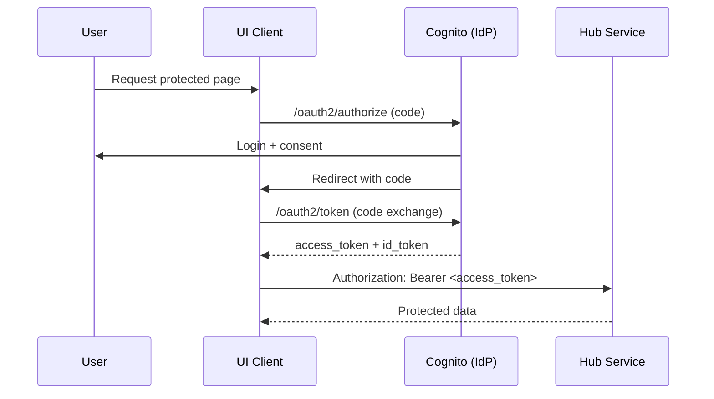

# OAuth 2.0 and OIDC Overview

OAuth 2.0 is an authorization framework that lets a client access resources on behalf of a user
without sharing the user's credentials. OpenID Connect (OIDC) is a thin identity layer on top
of OAuth 2.0 that adds authentication and an ID token (JWT) containing user claims.

Key roles
- Resource owner: the user
- Client: the application requesting access (UI)
- Authorization server (IdP): issues tokens (Cognito)
- Resource server: API that validates tokens (Hub Service)

Authorization Code Flow (recommended)
1) Client redirects the user's browser to the authorization server with:
   - client_id, redirect_uri, scope, response_type=code, state
2) Authorization server authenticates the user and asks for consent (if needed).
3) Authorization server redirects back to the client with a temporary authorization code.
4) Client exchanges the code for tokens via a back-channel request:
   - access_token (used to call APIs)
   - id_token (OIDC identity JWT)
   - refresh_token (optional)
5) Client calls the resource server with:
   - Authorization: Bearer <access_token>
6) Resource server validates the token (issuer, signature, expiry, audience) and processes the request.

Why OIDC matters
- OAuth 2.0 alone is authorization only.
- OIDC adds authentication, user identity, and a standardized ID token.

Mermaid flow


---

# Zynchub Hub Service: OAuth/OIDC (Cognito)

This section documents how OAuth/OIDC is implemented for Zynchub Hub Service.

Architecture
- UI (client) uses Cognito Hosted UI to authenticate users.
- Hub Service is a resource server that validates JWTs issued by Cognito.
- Local profile skips auth (security.enabled=false).

Cognito Hosted UI flow
1) UI redirects the browser to:
   https://<cognito-domain>/oauth2/authorize

   Query parameters:
   - response_type=code
   - client_id=<client-id>
   - redirect_uri=<callback-url>
   - scope=openid+email+profile
   - state=<opaque>

2) User logs in at Cognito.
3) Cognito redirects to redirect_uri with code.
4) UI exchanges the code at:
   https://<cognito-domain>/oauth2/token

   Body (x-www-form-urlencoded):
   - grant_type=authorization_code
   - client_id=<client-id>
   - redirect_uri=<callback-url>
   - code=<authorization_code>

5) UI calls Hub Service with:
   - Authorization: Bearer <access_token>

Hub Service validation
- Issuer:
  https://cognito-idp.<region>.amazonaws.com/<user-pool-id>
- JWKS:
  https://cognito-idp.<region>.amazonaws.com/<user-pool-id>/.well-known/jwks.json

Hub Service endpoints
- GET /auth/login
  - Redirects the browser to Cognito Hosted UI authorization endpoint.
- GET /auth/callback
  - Receives the authorization code and redirects to a configured post-login URL.
  - Token exchange is still performed by the UI client.

Token validation checks (Hub Service)
- Issuer matches security.jwt.issuer-uri.
- Signature verified using security.jwt.jwk-set-uri (JWKS).
- Token not expired.
- Token audience matches configured client ID.

Configuration
These properties are loaded via SSM Parameter Store into ECS:
- auth.cognito.domain
- auth.cognito.client-id
- auth.cognito.redirect-uri
- auth.cognito.post-login-redirect-uri
- security.jwt.issuer-uri
- security.jwt.jwk-set-uri

Environment variables (in ECS task definition)
- AUTH_COGNITO_DOMAIN
- AUTH_COGNITO_CLIENT_ID
- AUTH_COGNITO_REDIRECT_URI
- AUTH_COGNITO_POST_LOGIN_REDIRECT_URI
- SECURITY_JWT_ISSUER_URI
- SECURITY_JWT_JWK_SET_URI

Local behavior
- security.enabled=false
- No token required for API calls.

Dev/Test/Prod behavior
- security.enabled=true
- API returns 401 if token is missing or invalid.

Testing without UI
1) Open Hosted UI authorize URL in a browser to get code.
2) Exchange the code for tokens via /oauth2/token.
3) Call Hub Service API with Authorization: Bearer <access_token>.

Example authorize URL
```
https://<cognito-domain>/oauth2/authorize
  ?response_type=code
  &client_id=<client-id>
  &redirect_uri=<callback-url>
  &scope=openid+email+profile
  &state=<opaque>
```

Example token exchange (x-www-form-urlencoded)
```
grant_type=authorization_code
client_id=<client-id>
redirect_uri=<callback-url>
code=<authorization_code>
```

---

# Reference Links
- OAuth 2.0: https://www.rfc-editor.org/rfc/rfc6749
- OpenID Connect: https://openid.net/specs/openid-connect-core-1_0.html
- Cognito Hosted UI: https://docs.aws.amazon.com/cognito/latest/developerguide/cognito-userpools-server-contract-reference.html
